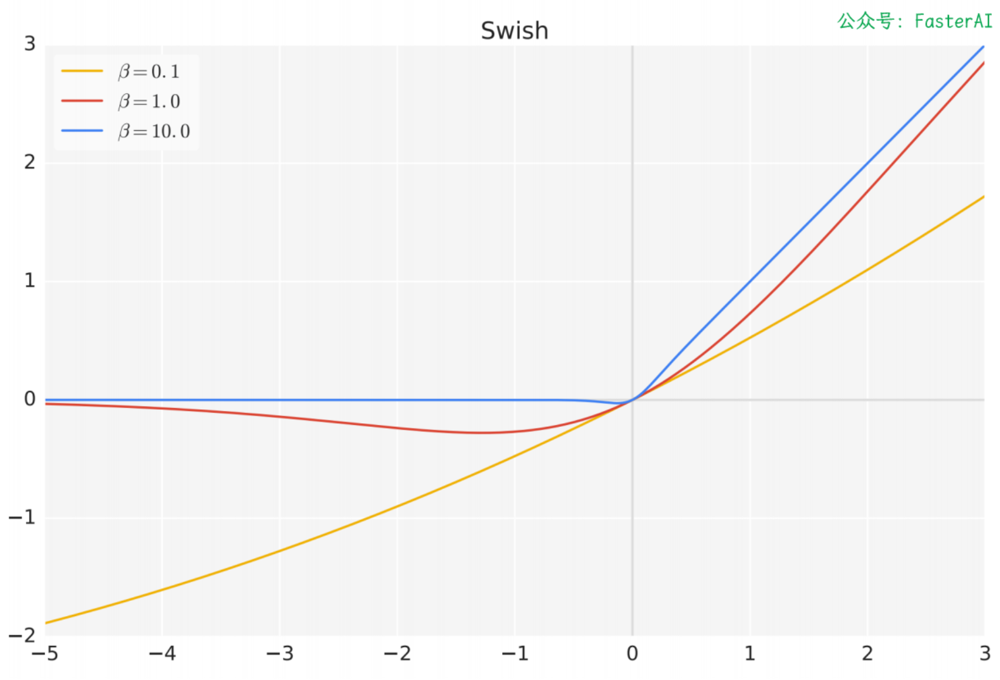

# SwiGLU 激活函数

6.16

### SwiGLU 激活函数长什么样？

**Swish-Gated Linear Unit（SwiGLU）的**表达式如下：

$$
\text{SwiGLU}(x) = A \cdot B \cdot \sigma(\beta B)
$$

其中 A 和 B 是线性变换后的结果，$\beta$ 是可学习参数。

- $$
  A = W_A \cdot x + b_A
  $$
- $$
  B = W_B \cdot x + b_B
  $$
- $$
  \sigma(z) = \frac{1}{1 + e^{-z}}
  $$

或者，可以写成另外一种形式：$\text{SwiGLU}(x) = A \cdot \text{Swish}(B)$

其中$\text{Swish}_\beta(z) = z \cdot \sigma(\beta z)$

### Swish 函数长什么样？

Swish 比 ReLU 激活函数更好，因为它在 0 附近提供了更平滑的转换。

Swish 激活函数在参数 β 不同取值下的形状：

