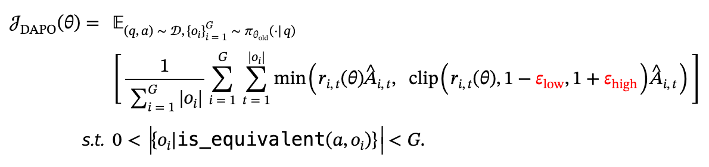

# clip-higher 为什么有效

### Clip-Higher

$$
0.8<\frac{\pi_{\theta}}{\pi_{old}}<1.2,则 \pi_{\theta}<1.2\pi_{old}
$$

故而把上界提高，可以

故而当 $\pi_{old}=0.01$时， $\pi_{\theta}=0.012$;当 $\pi_{old}=0.9$时, $\pi_{\theta}=1.08$。

故而可以看到对于熵低的，其实上界范围相对较低，而对于熵高的，上界范围相对要高；故而把上界提高，可以留给低概率更多空间。

