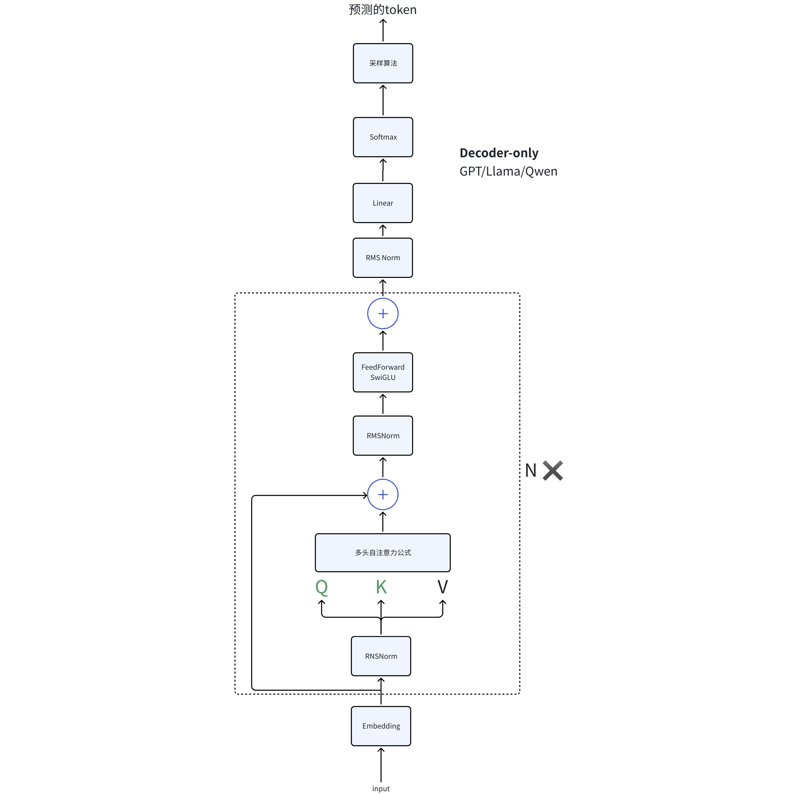

# 温度 temperature 是什么

## 参考博客

[zhuanlan.zhihu.com](https://zhuanlan.zhihu.com/p/504323465) 解释清楚了 temperature 温度大小

## 1.温度（Temperature）的作用

在大模型文本生成中，温度（Temperature） 是调节输出随机性的核心参数：

- 温度越高，输出越随机，适合追求多样性（如创意写作）；
- 温度越低，输出越确定，适合追求准确性（如事实问答）。

### 为什么温度会影响随机性？

因为 T 会缩放 Softmax 输入，调控概率分布的“尖锐程度”：

模型输出层通过 **Softmax 函数** 计算下一个 token 的概率，温度 T 作用于 Softmax 的输入（logits，记为 $z_i$），公式为：

$$
p_i = \frac{e^{z_i / T}}{\sum_{j=1}^K e^{z_j / T}}
$$

其中 K 是词表大小（备选 token 总数）。

### 为什么温度高会随机性越大？

由极限公式可以看到，$\lim_{T \to +\infty} \frac{\exp(z_i / T)}{\sum_j \exp(z_j / T)} = \frac{1}{\sum_j 1} = \frac{1}{K}$

T 越大，$e^{z_i/T}$趋近相等，概率均匀分布：

反之，$\lim_{T \to 0} \frac{\exp(z_m / T)}{\sum_j \exp(z_j / T)} = \lim_{T \to 0} \frac{1}{1 + \sum_{j \neq m} \exp\left( \frac{1}{T}(z_j - z_m) \right)} = 1$，令$z_m$是最大的 logit，

## 2.具体温度作用在 llm 的哪个结构？

### 图中理解

看下图可以看到是在最后的输出环节中。



### 从公式理解维度变化

由于训练和推理的时候预测 token 的方式有区别，故而分开说

- **训练时**：模型一次性预测出整个序列每个位置的下一个 token（并行）
- **推理时**：模型每次只预测下一个 token（串行），然后追加到输入中，继续预测下一个

假设：

- batch size = B
- 序列长度 = T
- embedding 维度 = D
- 词表大小 = V

---

#### 一、训练阶段的维度变化

**目标**：让模型“并行”地预测每个位置的下一个 token。

1. 输入 token 序列

形状: `(B, T)` 比如：`[[BOS, 他, 去, 了, 学校], [BOS, 她, 吃, 了, 苹果]]`

2. 词嵌入（Embedding）

形状: `(B, T, D)` 每个 token id 变成 D 维向量

3. 位置编码相加

形状: `(B, T, D)` 只改变数值，形状不变

4. 经过 N 层 Decoder

形状: `(B, T, D)` 每层都保持这个形状

5. 全连接层（Linear 到 V）

形状: `(B, T, V)` 把 D 维向量投影到词表 V 维

6. Softmax 概率分布

形状: `(B, T, V)` 每个位置是 V 个词的概率

7. 计算 loss（交叉熵）

用目标输出序列（labels, 形状 `(B, T)`），和上面的概率分布对比

损失对每个位置、每个 batch 都计算（并行）

#### 二、推理（生成）阶段的维度变化

**目标**：一个 token 一个 token 地生成，直到输出结束。

1. 输入已生成的 token 序列。

假设当前已生成 t 个 token，形状: `(B, t)`

t 是当前生成到的位置（会逐步变长）

2. 词嵌入

形状: `(B, t, D)`

3. 位置编码相加

形状: `(B, t, D)`

4. 经过 N 层 Decoder

形状: `(B, t, D)`

5. 只取最后一个位置的输出

形状: `(B, D)`

6. 全连接层（Linear 到 V）

- 形状: `(B, V)` 只对最后一个 token 预测下一个词的概率分布

7. Softmax & 采样/argmax

- 形状: `(B, V)`
- 选出概率最大的 token（或采样），形状: `(B,)`
- 新的 token 拼接到序列末尾，继续下一步

### 对比总结表

<table>
<tr>
<td>阶段<br/></td><td>训练阶段维度<br/></td><td>推理阶段维度（每步）<br/></td></tr>
<tr>
<td>输入token序列<br/></td><td>(B, T)<br/></td><td>(B, t)（t逐渐递增）<br/></td></tr>
<tr>
<td>Embedding<br/></td><td>(B, T, D)<br/></td><td>(B, t, D)<br/></td></tr>
<tr>
<td>Decoder输出<br/></td><td>(B, T, D)<br/></td><td>(B, t, D)<br/></td></tr>
<tr>
<td>Linear<br/></td><td>(B, T, V)<br/></td><td>(B, V)（只取最后一位）<br/></td></tr>
<tr>
<td>预测token<br/></td><td>(B, T)<br/></td><td>(B,) （每次1个token）<br/></td></tr>
</table>

### 训练和推理的图示对比

##### 训练阶段（并行预测全部 token）

```
[所有token输入]  => (B, T)
      |
[Embedding & Positional] => (B, T, D)
      |
[Decoder N层]   => (B, T, D)
      |
[Linear]        => (B, T, V)
      |
[Softmax]       => (B, T, V)
      |
[Loss]          => (B, T)
```

##### 推理阶段（每步只预测 1 个 token，循环生成）

```
[已生成token输入] => (B, t)  (t逐步增长)
      |
[Embedding & Positional] => (B, t, D)
      |
[Decoder N层]   => (B, t, D)
      |
[取最后一位]    => (B, D)
      |
[Linear]        => (B, V)
      |
[Softmax/argmax]=> (B,)
      |
[拼接新token，继续下一步]
```
