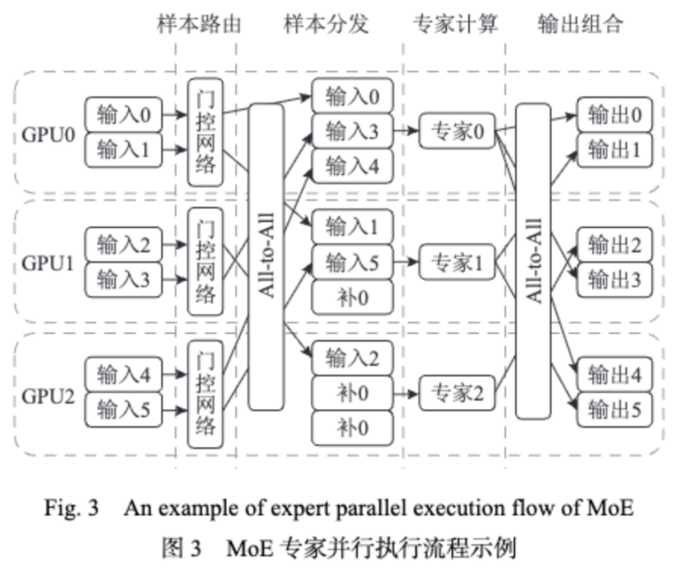
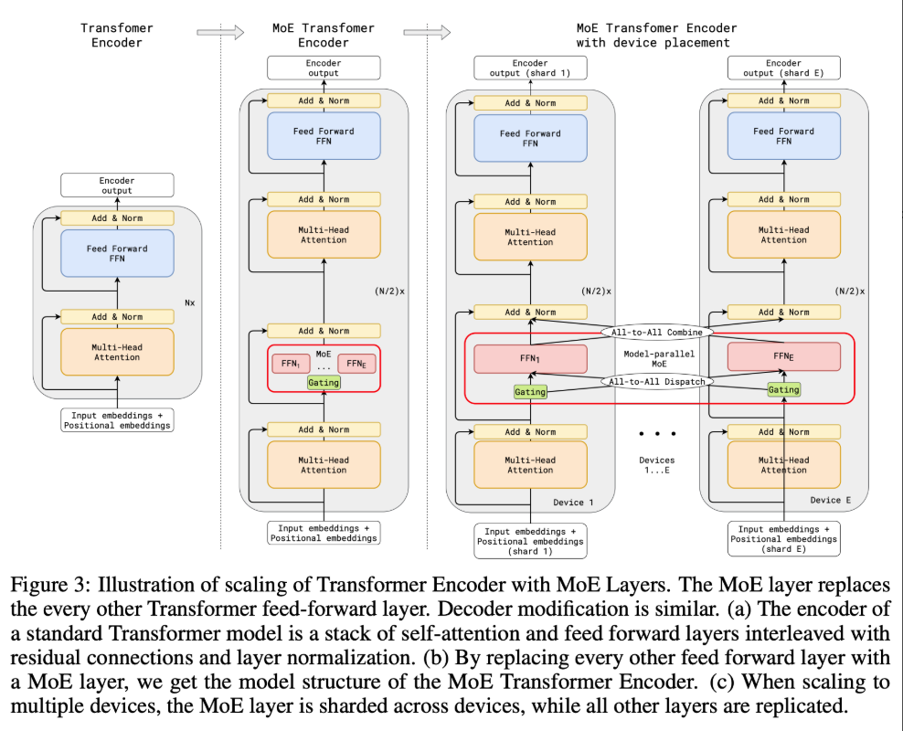

# 背景知识

### MoE 的并行方式：

在 GShard 论文中，MoE 的并行方式是将不同专家放置在多个设备上并行执行，而非专 家 层 则 以 数 据 并 行 方 式 执 行. 由 于 专 家 位 于 不 同设 备 上，需 要 执行 All-to-All 通 信 将 输 入 样 本 分 发 给相 应 专 家，并 在 专 家 处 理 后 将 专 家 输 出 恢 复 到 样 本原始位置.




### 负载均衡 loss 的实现：

参考 [https://wnma3mz.github.io/hexo_blog/2024/06/15/MoE%E4%B8%AD%E8%B4%9F%E8%BD%BD%E5%9D%87%E8%A1%A1Loss%E5%AE%9E%E7%8E%B0%E5%AF%B9%E6%AF%94/](https://wnma3mz.github.io/hexo_blog/2024/06/15/MoE%E4%B8%AD%E8%B4%9F%E8%BD%BD%E5%9D%87%E8%A1%A1Loss%E5%AE%9E%E7%8E%B0%E5%AF%B9%E6%AF%94/)

注意最开始输入序列为[batch_size, seq_len, hidden_dim]，多头注意力结果为[batch_size, num_heads, seq_len, head_dim]，经过全连接网络实现的门控网络最后实现的是[batch_size, seq_len, num_experts]。

```python
def load_balancing_loss_func1(gate_logits: torch.Tensor, num_experts: torch.Tensor = None, top_k=2) -> float:
    """
    计算混合专家模型(MoE)的负载均衡损失，确保样本在专家间分配更均衡
    """
    if isinstance(gate_logits, tuple):
        # 拼接多层门控输出（如果有）
        compute_device = gate_logits[0].device
        # [batch_size × sequence_length × num_layers, num_experts]
        concatenated_gate_logits = torch.cat([layer_gate.to(compute_device) for layer_gate in gate_logits], dim=0)
    else:
        # [batch_size × sequence_length, num_experts]
        concatenated_gate_logits = gate_logits
    
    # 将门控输出转换为概率分布
    # [batch_size × sequence_length (× num_layers), num_experts]
    routing_weights = torch.nn.functional.softmax(concatenated_gate_logits, dim=-1)
    
    # 选择概率最高的top_k个专家
    # indices shape: [batch_size × sequence_length (× num_layers), top_k]
    _, selected_experts = torch.topk(routing_weights, top_k, dim=-1)
    
    # 将选中的专家转换为one-hot编码
    # [batch_size × sequence_length (× num_layers), top_k, num_experts]
    expert_mask = torch.nn.functional.one_hot(selected_experts, num_experts)
    
    # 计算每个专家被选中的频率（相对于总样本数）
    # [top_k, num_experts]
    tokens_per_expert = torch.mean(expert_mask.float(), dim=0)
    
    # 计算每个专家被路由到的平均概率
    # [num_experts]
    router_prob_per_expert = torch.mean(routing_weights, dim=0)
    
    # 损失计算：鼓励高概率路由的专家承担更多负载
    # [top_k, num_experts] × [1, num_experts] -> [top_k, num_experts] -> 标量
    overall_loss = torch.sum(tokens_per_expert * router_prob_per_expert.unsqueeze(0))
    
    # 缩放损失以平衡不同规模模型
    return overall_loss * num_experts
```
