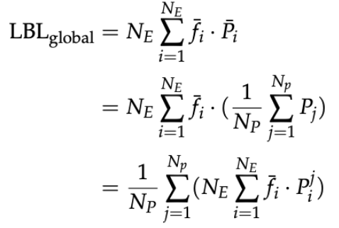
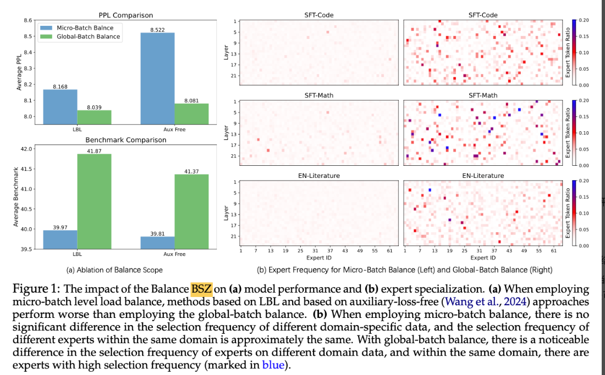
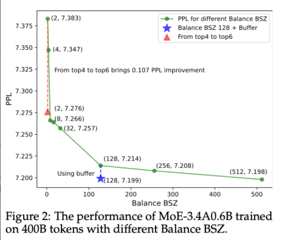
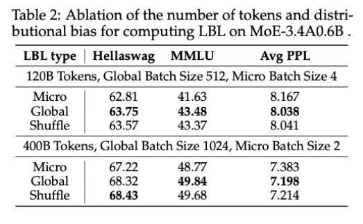
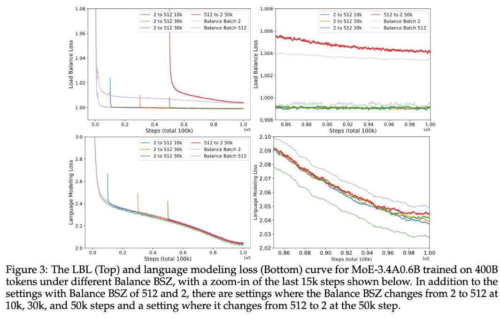
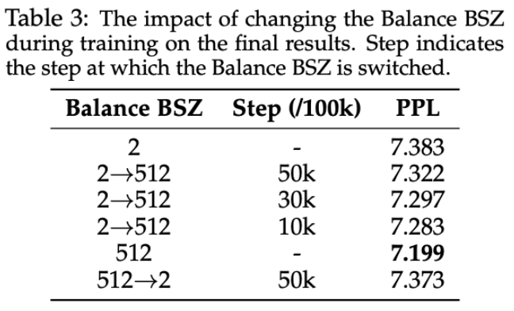
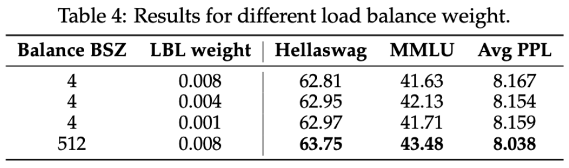
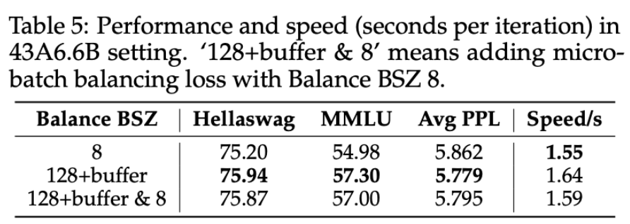
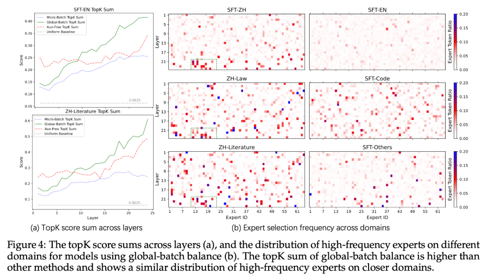

# Demons in the Detail: On Implementing Load Balancing Loss for Training Specialized Mixture-of-Expert

论文链接：[https://arxiv.org/pdf/2501.11873](https://arxiv.org/pdf/2501.11873)

笔记日期： 6 月 20 日

## 动机

现有的 MoE 训练方式通常采用并行的方式，故而负载平衡损失函数（LBL，Load-balacing Loss）通常是基于微批次计算的（miCro-batch )。

这样会存在两个问题：（1）当一个微批次包含的序列都是一个领域知识的，路由器仍会被促使均匀分配给锁欧专家，这会阻碍专家的专业化。（2）微批次比全局批次的多样性机率更差，可能出现里面的序列都是“打包”和“截断”处理得到的，这样会使得 MOE 从 token 的角度去决定分配给哪个专家，而不是从专家擅长的这个领域任务这个层面去分配。

故而本文提出要从全局批次角度，综合考虑并行组情况，来计算 LBL。

> “打包” 是指将多个较短的序列合并在一起，填充一些占位符（比如特殊的填充 token ），使它们在长度上保持一致，便于批量处理；“截断” 是指如果序列过长，会将其截短到模型能够处理的最大长度。

## BSZ 表示计算专家频率时的分母

## 方法

### 1.通过修改基于微批次的 LBL 公式中的 $f_i^j$为 $\bar{f}$。

先看普通 LBL 的计算方式，其中 $N_E$表示专家数量, $f_i$表示第 i 个专家被 token 选择的概率（选择第 i 个专家被选择的次数除以总的总的 token 数，如果是跨层计算时则总的 toekn 数为 batchsize*sequence length*layer）,$P_i$表示每个专家被路由到的平均概率（即路由器输出每个 token 到 i 的概率，然后再取平均）。

$$
\begin{equation} \text{LBL} = N_E \sum_{i=1}^{N_E} f_i \cdot P_i \end{equation}
$$

在数据并行的情况，通常把一个全局批次分成$N_P$个微批次，然后每个微批次内计算 LBL，再最终对这个 LBL 取平均，表达式为：

$$
\begin{equation} \text{LBL}_{\text{micro}} = \frac{1}{N_p} \sum_{j=1}^{N_p} \left( N_E \sum_{i=1}^{N_E} f_i^j \cdot P_i^j \right) \end{equation}
$$

而本文的方法是直接基于全局批次的，对于 LBL 中的参数 $f_i$和$P_i$都是在计算基于微批次后的平均值再代入算，如对于 LBL 公式中的 $f_i$替换成了$N_P$个微批次后的平均值 $\bar{f_i}$ 。

然而这样展开后发现对$LBL_{micro}$公式的修改仅仅是 $f_i^j$ 替换成了基于微批次平均后的 $\bar{f_i}$。

## 实验结果

### 评测数据集：

#### **Benchmark（基准测试）指标，使用如下基准**

该类测试有明确的答案

- **English (Hellaswag)**：一个英语常识推理基准，测试模型在开放式场景理解中的能力（例如预测故事的后续发展）。
- **MMLU (Massive Multitask Language Understanding)**：多任务语言理解基准，涵盖 57 个学科（如数学、历史、物理等），评估模型的通用知识和推理能力。
- **GSM8k (Grade School Math 8K)**：小学数学基准，包含 8000 道数学应用题，测试模型的数学解题能力。
- **C-Eval**：中文能力评估基准，覆盖 52 个学科（如法律、医学、文学等），评估中文模型的专业知识和推理能力。

#### **困惑度（PPL）评估基准**

特点：更全面地反映模型对各种文本的理解能力，尤其在无明确标准答案的场景（如文学、开放生成）中更可靠。

- **SFT-EN**：英语指令微调数据集的测试集。
- **EN-Literature**：英语文学领域的测试集。
- **SFT-Code**：代码指令微调数据集的测试集。
- **SFT-Math**：数学指令微调数据集的测试集。
- **SFT-ZH**：中文指令微调数据集的测试集。
- **ZH-Law**：中文法律领域的测试集。
- **ZH-Literature**：中文文学领域的测试集。
- **SFT-Other**：其他领域指令微调数据集的测试集。

**困惑度（PPL）** 用于衡量模型对未见数据的预测能力，值越低表示模型性能越好。

### 实验一：

**对比模型：**实验对比了 3 种规模的 MoE 模型，并使用不同的负载平衡损失函数方式训练模型，其中 LBL 就是只用 1 个卡的，$LBL_{micro}$，而 LBL+sync 就是 $LBL_{global}$，Aux Free 就是不加负载平衡这一项。

**实验设置：**在 4 个基准测试集上计算得分，并计算平均困惑度得分。

在第一大组里，

前 3 组实验中（BSZ 增大的方式为，1 个 gpu 上 4，8 个 gpu 为 32，16 台机器上则为 512），说明越大 BSZ，数值表现越高。

第 4-5 组实验，是没有均衡负载的损失情况，发现 BSZ 为 512 时要比 4 时要好，说明即使再没有均衡负载的情况下，BSZ 越高，数值表现也会越好。

在第二大组里，

第 4 组实验是使用了本文提出的 buffer 的方法，发现它在 BSZ=128 的情况下会与计算节点（node）充足情况即 BSZ=512 下数值相近，会比不用本文方法的 BSZ=128（第 2 组实验）要好。

在第三大组里，

### 实验二

**图片含义**：图(a)对比了有无 LBL，和小批次和全局批次的情况。上图使用指标是多个微调数据集的测试集的困惑度比较，下图是在多个下游任务评估基准上的平均得分。

**分析：**在这两个指标中，使用全局的批次平衡要比使用微小批次的要好；使用 LBL 要比不使用好。

图 b

**图片含义：**图（b）是解决不同问题(SFT-Code,SFT-Math,)时专家被选择的频率，左图是使用基于微批次的 LBL 结果，右图是基于本文提出的 LBL 结果。

**分析：**看到左图中大多数选择频率在 EN-Literature 下是相同的，只有少数专家在 SFT-Code 和 SFT-Math 下的频率略高，但没有超过 0.15，这说明当前的情况没有出现域级（即某个问题领域）专家话，而是出现了 token 级的专家化。相反，图 b 中，对于 SFT-Math 问题，出现了更加频率超过 0.2 的专家，说明本文提出的 LBL 方法可以有助于域级专家化。

### 实验三

分析：

（1）随着 BSZ 增大，困惑度下降，这说明通过并行机制增加的 BSZ 非常有效提升模型效果。

（2）然而当 BSZ 从 128 继续的时候，困惑度下降的不够明显，但这里使用本文提出的 buffer 的方法来实现全局 LBL 的方式就可以使得在 128 的批次效果也能达到接近 512 的批次效果。

## 分析

### 实验一

**实验目的：**本文基于全局批次的 LBL 有效，是否是因为计算 LBL 时使用更多的 tokens，从而减少了方差才得到比基于微批次的 LBL 好的效果。

**验证方式：**为验证上述观点，引入 “Shuffle LBL_micro” 设置。通过该设置，在计算负载均衡时，使随机选取的一批令牌在数量上与微批次相同，在分布上与全局批次相同，以此区分令牌数量和分布偏差这两个干扰因素，探究它们对模型性能的影响。

实验结果：表 2 显示 shuffle 的结果与 global 的情况接近，说明是分布对模型性能产生影响，而不是 token 的数量。

### 实验二

#### **实验目的：**

**验证本文提出的全局批次负载均衡约束相比于微批次负载均衡约束要更宽松会有什么影响。（因为**$LBL_{global}$计算的时候基于全局 token，而$LBL_{micro}$是基于局部批次的。**）**

#### **实验设置：**

- “2 to 512 10k”：表示平衡批次大小从 2 在第 10,000 步变为 512 。
- “2 to 512 30k”：表示平衡批次大小从 2 在第 30,000 步变为 512 。
- “512 to 2 50k”：表示平衡批次大小从 512 在第 50,000 步变为 2 。
- “Balance Batch 2”：平衡批次大小始终为 2 。
- “Balance Batch 512”：平衡批次大小始终为 512 。

上图是是负载损失函数的收敛情况，下图是语言建模损失函数的收敛情况，右边是左边的放大细节。

#### **实验分析：**

###### **现象 1: **

从小批次（BSZ=2）到大批次（BSZ=512），原本呈现下降收敛趋势的负载平衡损失会先上升后下降，最后收敛到一个比始终大小为 2 还要低，和始终大小为 512 接近一样的 loss 值。然而从大批次 512 转换到小批次 2 的时候，约束收敛到接近一直是 2 的状态。

**分析:** 说明三方面问题：第一从 从严格约束过渡到宽松约束相对容易；第二这种转换会影响收敛状态。

###### **现象 2:**

在语言建模损失方面，2 to 512 的转换使得损失降低到比一直是 2 的情况要低，且越早转换收敛值越低；对于表 3 的困惑值也是这样的情况。

**分析：**这说明 BSZ 对模型性能影响大

##### 实验总结：

BSZ 增大可以提升模型性能，即使在训练过程中切换到大的 BSZ 也能提升模型性能。

### 实验三：

#### 实验动机：

$LBL_{micro}$由于比 $LBL_{global}$要紧凑而效果不好，那么可不可以通过降低 LBL 的权重系数来增强性能

#### 实验设置：

减少权重为 0.004 和 0.001

**现象:  **权重从 0.008 减少到 0.004 的时候性能提升，但是降低到 0.001 的时候更差了。但是效果始终没有比 BSZ 为 512 的情况好。

**分析：**MoE 权重系数过大和过小都会影响到专家平衡问题

**总结：**$LBL_{micro}$需要注意系数的影响，效果不如$LBL_{global}$

### 实验四：

#### 实验动机：

$LBL_{global}$的计算会比$LBL_{micro}$要慢，可以不可以从第 20k 训练开始，把 1% 的$LBL_{global}$替换成$LBL_{micro}$，希望观察此时精度和速度的变化。

#### 实验设置：

**现象：**表 5 的第 3 行可见，精度下降一点点但是速度提升了

**总结：**在使用$LBL_{global}$会存在速度慢的情况，可以通过这种混合$LBL_{micro}$的方式以牺牲少量精度换速度。

### 实验五

#### 实验动机：

探究全局批次平衡如何带来可解释的模型专业化。

#### 实验设置：

在图 4（a）中，记录不同领域的令牌分配给每个专家的分数，并计算 topK 分数总和的平均值 。当所有专家被分配相同身份分数时，topK 总和由灰色虚线表示。

#### 实验分析

##### 现象 1:

图 a 是不同平衡方式下模型各层的 topK 分数总和情况。看到 Global-batch 的方式分布的很开，
