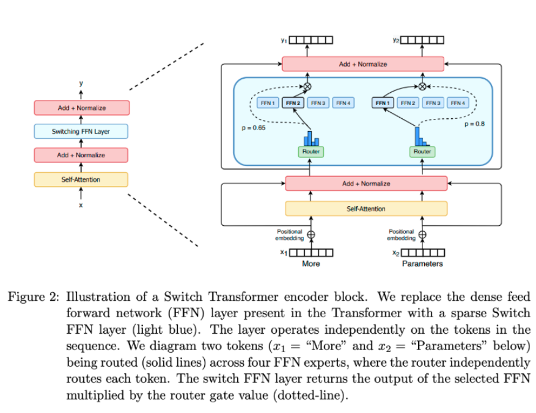
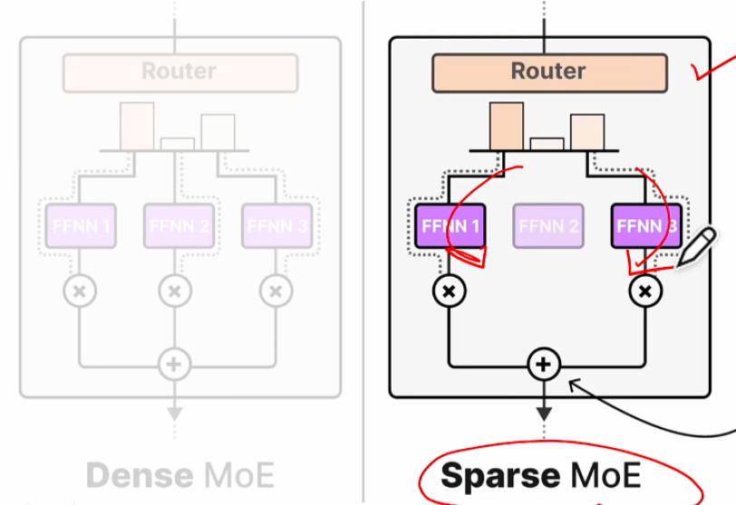
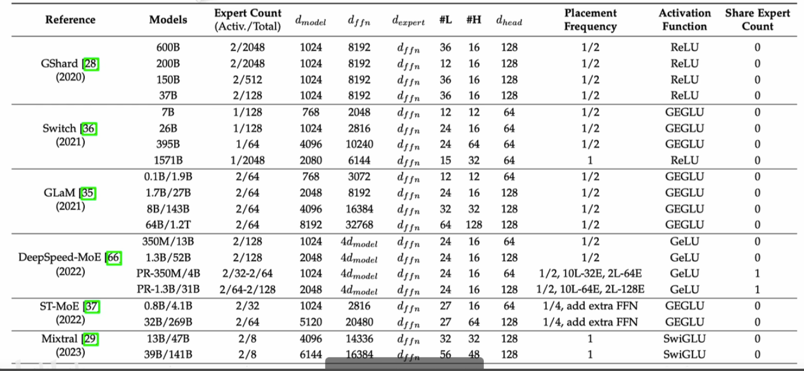
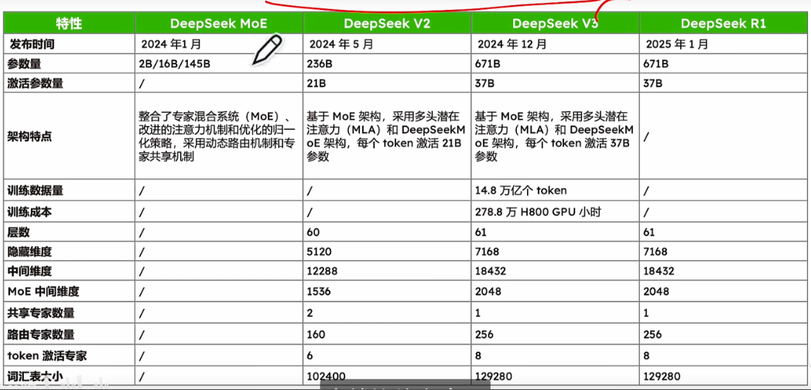
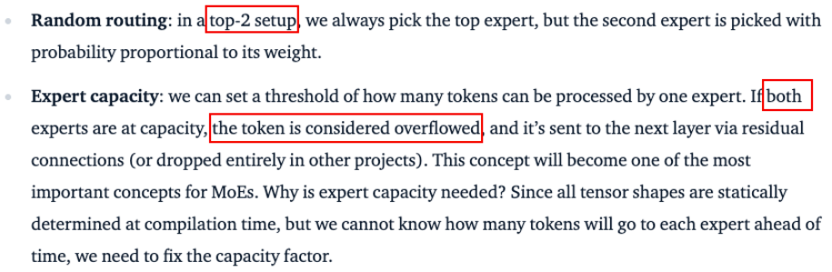
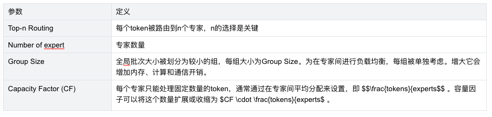
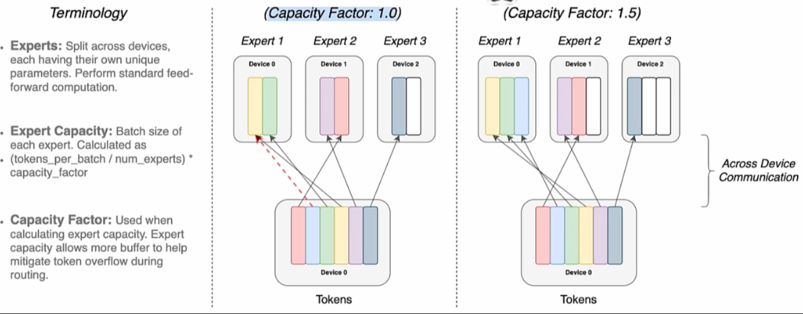
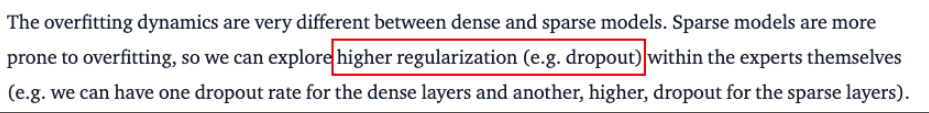
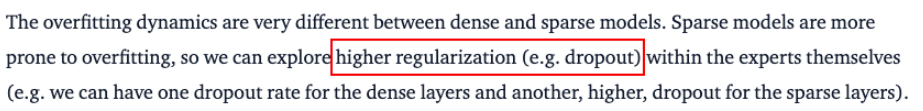
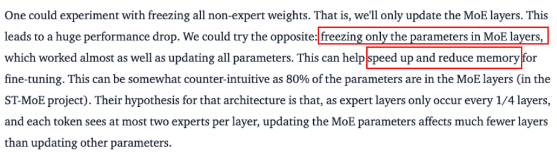

# Mixture of Experts Explained

文章来源：[https://huggingface.co/blog/moe#switch-transformers](https://huggingface.co/blog/moe#switch-transformers)

## 动机：

这篇博客发表于 2023 年 12 月 1 日，介绍了早期 MoE 的内容（早期是少专家大参数，deepseek 后是多专家小参数), 包含 MOE 结构的设计，训练存在的问题，提出的改进。它重点参考了 Switch transfomer，ST-MOE 论文的内容，写作思路是通过回答问题的方式串联起来。
而本阅读总结考虑到时效性，借鉴了 [https://www.bilibili.com/video/BV1y7wZeeE96](https://www.bilibili.com/video/BV1y7wZeeE96) 中的内容，对历史发展内容做了补充，对部署相关的并行技术做了省略。

## 问题 1：什么是 MOE？

MoE 是一个组件级的设计思想，它把 Transformer 中的稠密计算层（dense feed forward network，FFN，由线性层、激活函数、线性层组成）替换成了 sparse switch FFN layer，如此替换后涉及如何稳定训练路由层来选择合适的专家，故而有很多相关的研究。

> 

## 问题 2: MoE 的优点是什么？

在总计算量不变的前提下，增大模型的参数规模通常能带来更好的效果（Switch transfomer 论文中提到并证明），而 MoE 有很多参数，但只有少部分在推理时被激活，故而当有与 dense 模型相同参数量的时候，会有更快的推理时间。或者说可以在显存大单算力中等的硬件上取得在显存大算力好的硬件上的稠密模型一样的效果。

以下面的例子举例，MoE 在和 dense 模型在相同参数量的情况下，计算量会更少。其中数值上关注 2 点：1. 对于 8*7B 的模型，总参数量不是 56B，而是 47B，这是因为除了专家 FFN 部分，其他都是共用的。2. 推理的时候，是从 8 个专家里选 2 个（设置了 1 个 token 要选 2 个专家 MoE），故而实际计算量是 12B。

## 问题 3: MoE 发展的历史

这篇博客对于发展历史提的比较少，故而这部分内容，是根据 [https://www.bilibili.com/video/BV1y7wZeeE96](https://www.bilibili.com/video/BV1y7wZeeE96) 这个视频整理的。
第一个表是关键理论创新的发展历史，第 2 个表是不同早期 MoE 模型（大参数少专家）的参数情况，第 3 个表是 deepseek（少参数多专家）的参数情况。

## 问题 4: MoE 的负载均衡问题

### 分点 a: 为什么要确保负载均衡？

如果负载不均衡时，则少部分专家会频繁被激活，部分专家会闲置，这时候有 2 个问题：

1. 模型性能退化成了少参数的稠密模型，模型性能下降。
2. 部分专家长期闲置，导致显卡资源浪费。

### 分点 b: 如何增强负载均衡？

1. 路由算法的优化。比如随机 Top-K 门控算法，它是先给门控分数都加上随机噪声，然后最后去最好的 k 个作为专家。
2. 添加负载均衡辅助损失项：目的是鼓励所有专家有相同的重要性，可以通过确保所有专家接收到大致相等数量多训练样本实现。
3. 限制专家容量：设定一个阈值，定义一个专家能处理多少 token。如果在 top-n 的设定中，选择的 n 个专家都已经超过数量限制了，则会丢弃这个 token，或者通过残差连接到下一层中。

> 

## 问题 5: MoE 有哪些参数，对训练有什么影响？

### 分点 a: top-n Routing

1 个 toekn 选择 n 个专家，这是 top-n Routing。当 n>1 可以缓解 MoE 不均衡的问题，但是会增加通信成本。

### 分点 b: Capacity Factor (CF)

在 switch transfomer 这篇文章探索的结论是 CF=1~1.25 是最好的，文章认为这个参数的权衡关系是：容量系数大于 1 的时候，可以缓解 MOE 不均衡的问题；而当等于 1 的时候，这时候不同 device 的通信成本是最低的。

Expert Capacity = $\left( \frac{\text{tokens per batch}}{\text{number of experts}} \right) \times \text{capacity factor}$

而 CF 参数的物理含义可以从上面这个公式，并结合下图看出，其中 expert capacity 就是 1 个专家处理几个 token。

> 

### 分点 c: 专家数量

增加专家的数量，可以增加模型的参数量，在预训练中会有更好的效果。然而在微调时，减少模型的数量，可以有助于减少过拟合。

> 

## 问题 6: 微调 MoE 存在的问题？

MoE 相比于稠密模型，更容易出现过拟合现象，解决的办法有：

1. 使用更强的内部正则化，如高比例的 dropout。

> 

1. 冻结 MoE 的参数，训练公共部分。

> 
