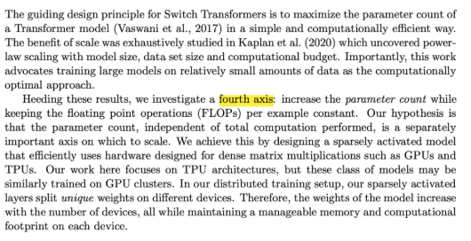
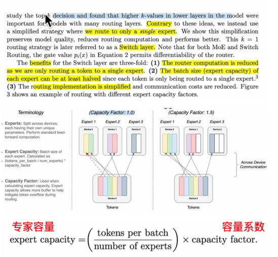

# switch transfomer 论文

### 前言：

学习 MOE 论文时，发现这篇文章，而看视频 [https://www.bilibili.com/video/BV1UsPceJEEQ](https://www.bilibili.com/video/BV1UsPceJEEQ)，了解到该文章有些技术略微过时，故而只看某一些部分。
本文创新点：本文用实验证明了只要路由到一个专家效果就足够好了。
论文地址：[https://arxiv.org/pdf/2103.14030](https://arxiv.org/pdf/2103.14030)

修改日期：5.21

### 论文总结：

Google 的 Noam Shazeer，Barret Zoph，William Fedus 等人，2021 年 1 月发表《Switch Transformers: Scaling to Trillion Parameter Models with Simple and Efficient Sparsity》，在 T5（encoder-decoder）基础上，简化 routing 策略，实现 1.6T 参数量 switch transformer。

- 特点：

  - 提出了 Switch Transformer 架构，简化了 MoE 的路由机制，仅选择单个 Expert 进行激活。
  - 通过稀疏门控机制和 Expert 容量限制，优化计算效率和负载均衡，实现万亿参数级模型规模扩展。
- 影响：

  - 展示了 MoE 在大模型中的潜力。
  - 对 scaling law、蒸馏很多详细探索，影响深远，MoE 领域重要工作。

### 看点 1: 模型性能扩展定理的第 4 个方法

模型性能扩展有 3 个公认的点：

1. 模型越大（参数量大），性能可以提升。
2. 训练数据要与模型规模匹配，避免欠拟合。
3. 总计算量（FLOPs）需要平衡模型和数据规模。

作者提出了第 4 个准则，就是 总的计算量不变，模型参数规模越大，也能提升大模型效果。

> 

### 看点 2: 使用单个专家效果好的原因

使用 1 个专家的好处是：1. 路由成本下降了，因为只路由到 1 个专家。2. 专家容量（1 个 device 上有几个专家）可以减少，因为之前一个 token 要交给至少两个专家处理，现在只给 1 个专家。 3.  路由简化也也使得通信成本下降(因为是分布式)。

> 
