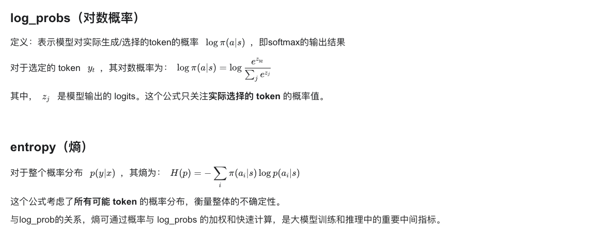
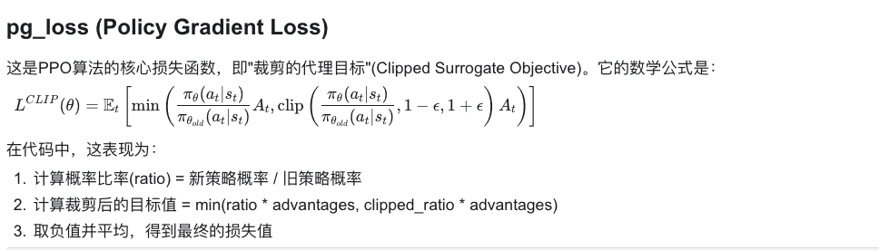
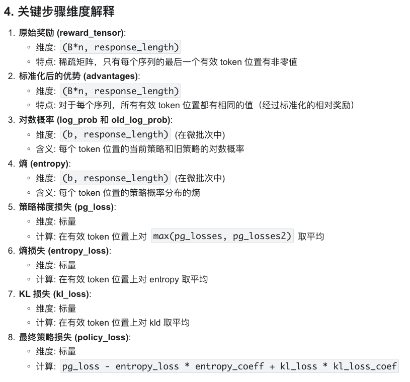

# VERL 框架看 GRPO 过程

## GRPO 流程

```yaml
for each epoch:
    for each batch:
        ##记batch为B
        ## 生成阶段
        给定prompt/query生成n个不同响应
        对响应生成计算奖励reward_tensor，维度为（B*n， response_length),只有最后一位token是非零奖励值。
        以同个prompt/query生成的响应作为一组，计算相对奖励A，这使得每个响应的奖励长度都是respnse_length，且每一位都是相同的值A。
        ##优化阶段
        将query和answer拼在一起，送入llm，获取对数概率log_probs,记为ref_logprobs,维度为 B*n *（query_length+response_length)，但只截取respnse_length的长度部分
        for each PPO_epoch:
            打乱样本顺序并创建mini-batches,记为b
            for each mini-batch:
                将query和answer拼在一起，送入llm，获取对数概率log_probs,维度为 b *（query_length+response_length)，但只截取response_length的长度部分
                计算策略梯度损失（pg_loss）；标量
                计算熵损失（entropy_loss），用于维持探索性；标量
                计算KL损失，用于控制策略更新幅度；标量
                组合损失 total_loss = pg_loss + c2*entropy_loss + c3*kl_loss。
                反向传播更新模型参数
```

## 其中公式解释



### 



```python
ratio = torch.exp(negative_approx_kl)
pg_losses = -advantages * ratio
pg_losses2 = -advantages * torch.clamp(ratio, 1.0 - cliprange, 1.0 + cliprange)
pg_loss = verl_F.masked_mean(torch.max(pg_losses, pg_losses2), eos_mask)
```

### KL Penalty

`kl_penalty` 通过惩罚当前策略与参考策略（通常是旧策略）的差异，防止过大的策略更新。

**函数参数**

- `logprob`: 当前策略下 token 的对数概率 $\log \pi(a|s)$
- `ref_logprob`: 参考策略下相同 token 的对数概率 $\log \pi_{\text{ref}}(a|s)$
- `kl_penalty`: 选择使用哪种 KL 散度计算方法

**代码实现及其数学公式**

1. 最简单的方式，是一种简化的近似，数学公式为：$D_{KL}(\pi_{\text{ref}} || \pi) \approx \log \pi(a|s) - \log \pi_{\text{ref}}(a|s)$

```python
if kl_penalty == "kl":
    return logprob - ref_logprob
```

1. **常用的方式，**是基于 Schulman 2020 年博客的实现，数学公式为：$D_{KL}(\pi_{\text{ref}} || \pi) \approx \frac{\pi_{\text{ref}}(a|s)}{\pi(a|s)} - \log\frac{\pi_{\text{ref}}(a|s)}{\pi(a|s)} - 1$或者写为：$D_{KL}(\pi_{\text{ref}} || \pi) \approx e^{(\log \pi_{\text{ref}}(a|s) - \log \pi(a|s))} - (\log \pi_{\text{ref}}(a|s) - \log \pi(a|s)) - 1$

```python
if kl_penalty == 'low_var_kl':
    kl = ref_logprob - logprob
    ratio = torch.exp(kl)
    kld = (ratio - kl - 1).contiguous()
    return torch.clamp(kld, min=-10, max=10)
```

### advantage 的计算

> 回答：在上面的损失函数中出现了 A 这一项，即 advantage，那么怎么计算它呢？

GRPO 将同一提示的不同回答视为一组，通过标准化使得优势估计更加稳定，并且对不同难度的提示更加公平。

对于同一个 prompt $p$ 的一组回答，优势计算为：

$$
A_i = \frac{R_i - \mu_p}{\sigma_p + \epsilon}
$$

其中：

- $R_i$ 是第 $i$ 个回答的总奖励
- $\mu_p$ 是同一 $p$ 的所有回答的奖励均值
- $\sigma_p$ 是同一 $p$ 的所有回答的奖励标准差
- $\epsilon$ 是一个小常数，防止除零

```python
NOTE(sgm): this implementation only considers outcome supervision, where the reward is a scalar.
def compute_grpo_outcome_advantage(token_level_rewards: torch.Tensor,
                                   eos_mask: torch.Tensor,
                                   index: torch.Tensor,
                                   epsilon: float = 1e-6):
    """
    Compute advantage for GRPO, operating only on Outcome reward 
    (with only one scalar reward for each response).
    Args:
        token_level_rewards: `(torch.Tensor)`,这个就是奖励，会在下一个部分中的reward_tensor
            shape: (bs, response_length)
        eos_mask: `(torch.Tensor)`
            shape: (bs, response_length)
    
    Returns:
        advantages: `(torch.Tensor)`
            shape: (bs, response_length)
    """
    response_length = token_level_rewards.shape[-1]
    scores = token_level_rewards.sum(dim=-1)。#对最后一个维度respnse_length求和，得到序列的总奖励，故而最后形状是（bs，)，每个元素对应一个序列的总奖励。
    
    # 按prompt的ID分组，收集同一prompt的不同响应的奖励
    id2score = defaultdict(list)
    id2mean = {}
    id2std = {}
    with torch.no_grad():
        bsz = scores.shape[0]
        for i in range(bsz):
            id2score[index[i]].append(scores[i])
        ## 对每组计算均值和标准差
        for idx in id2score:
            if len(id2score[idx]) == 1:
                id2mean[idx] = torch.tensor(0.0)
                id2std[idx] = torch.tensor(1.0)
            elif len(id2score[idx]) > 1:
                id2mean[idx] = torch.mean(torch.tensor(id2score[idx]))
                id2std[idx] = torch.std(torch.tensor([id2score[idx]]))
            else:
                raise ValueError(f"no score in prompt index: {idx}")
        ## 标准化分数
        for i in range(bsz):
            scores[i] = (scores[i] - id2mean[index[i]]) / (id2std[index[i]] + epsilon)
        scores = scores.unsqueeze(-1).tile([1, response_length]) * eos_mask    
        ##这个unsqueeze直接把 维度为b的tensor，变成了维度为b*response_length，且这个扩展出来的位置值大小都是一样的；eos_mask时因为不同回答长度不一样，故而要做一个padding。
    return scores
```

### 奖励的实现

> 回答：在知道 advantage 公式之后，那么标量奖励是怎么计算的

在 verl.trainer.main_ppo.TaskRunner.run 中有 reward_fn 设置了 reward 的类实现。

奖励计算的流程为：

1. 首先对大模型生成的 response token ids 进行解码，得到文本字符串
2. 然后根据不同任务的特点，从解码后的文本中提取答案（如使用正则表达式查找特定格式）
3. 将提取的答案与正确答案（ground_truth）进行比较
4. 最后，生成一个稀疏奖励张量，将分数只赋值给最后一个有效 token 位置，其余位置为零，得到 reward_tensor，也就是上面的 token_level_rewards。

```python
# decode
##1.首先对大模型生成的 response token ids 进行解码，得到文本字符串
prompt_str = self.tokenizer.decode(valid_prompt_ids)
response_str = self.tokenizer.decode(valid_response_ids)

## 2.然后根据不同任务的特点，从解码后的文本中提取答案（如使用正则表达式查找特定格式）
ground_truth = data_item.non_tensor_batch['reward_model']['ground_truth']
data_source = data_item.non_tensor_batch['data_source']
extra_info = data_item.non_tensor_batch.get('extra_info', None)
......

## 3.将提取的答案与正确答案（ground_truth）进行比较，获得奖励reward
reward = self.compute_score(
    data_source=data_source,
    solution_str=response_str,
    ground_truth=ground_truth,
    extra_info=extra_info,
    reward_type=self.config.data.reward_type
)
if self.config.data.execution_error_penalty and data_item.batch['execution_passes'].item()==0:
    reward-=0.5

## 4.最后，生成一个稀疏奖励张量，将分数只赋值给最后一个有效 token 位置，其余位置为零
reward_tensor[i, valid_response_length - 1] = reward
```

## Disccussion

1. 为什么 verl 框架不直接以 batch 作为更新单位，而要向下拆出 mini_batch 作 policy model 的梯度更新单位呢？

答：？

1. 为什么计算奖励的时候，要用一个只有 1 位不是 0 的 reward_tensor 来存储 reward，而不是用一个标量直接存储 reward？

答：可能是 verl 框架为了兼容 PRM,PRM 会对不同位置的 token 打分。

> - ORM（[Outcome Reward Model](https://zhida.zhihu.com/search?content_id=253053742&content_type=Article&match_order=1&q=Outcome+Reward+Model&zhida_source=entity)）是在生成模型中，对生成结果整体打分评估。
> - PRM（Process Reward Model）是在生成过程中，分步骤对每一步进行打分的更细粒度奖励模型。

## 更加详细的 GRPO 完整流程（含维度信息）

1. 整体训练循环结构

```python
for each epoch:
    for each batch B: (每个batch包含多个prompt)
```

1. 生成阶段

```markdown
# 1. 生成响应
给定 prompts，维度为 (B, prompt_length)
使用 actor 模型生成 n 个响应，每个 prompt 产生 n 个不同响应
- 结果 responses 维度: (B*n, response_length)，其中 B 是原始批次大小，n 是每个 prompt 生成的响应数

# 2. 计算原始奖励
生成稀疏奖励 reward_tensor，维度为 (B*n, response_length)
- 对于每个响应，只有最后一个有效 token 的位置有非零奖励值
- reward_tensor[i, valid_response_length[i]-1] = score[i]

# 3. 计算参考策略的对数概率（如果启用）
将 prompt+response 送入参考策略模型
- 获取 ref_log_prob，维度为 (B*n, response_length)

# 4. KL惩罚应用（如果启用）
如果配置了使用 KL 惩罚：
  - 计算 KL 散度：kld = log_probs - ref_log_probs，维度为 (B*n, response_length)
  - 应用 KL 惩罚：token_level_rewards = token_level_scores - beta * kld，维度为 (B*n, response_length)
否则：
  - token_level_rewards = token_level_scores，维度为 (B*n, response_length)

# 5. 计算 GRPO 优势
token_level_rewards 维度: (B*n, response_length)
eos_mask 维度: (B*n, response_length)
index 维度: (B*n)，标识每个响应对应的原始 prompt ID

a. 首先计算每个序列的总奖励
   scores = token_level_rewards.sum(dim=-1)，维度: (B*n)
   
b. 按 prompt ID 分组
   对于每个不同的 index 值，收集所有对应的 scores

c. 对每组计算均值和标准差
   id2mean[idx] = mean(scores for prompt idx)
   id2std[idx] = std(scores for prompt idx)

d. 标准化每个组内的分数
   scores[i] = (scores[i] - id2mean[index[i]]) / (id2std[index[i]] + epsilon)，维度: (B*n)
   
e. 将标准化后的分数扩展到每个序列的每个有效位置
   scores = scores.unsqueeze(-1).tile([1, response_length]) * eos_mask
   - 将 (B*n) 维度扩展为 (B*n, response_length)
   - 最终 advantages 维度: (B*n, response_length)，每个序列的所有有效 token 位置都有相同的优势值
```



1. GRPO 的核心特性

GRPO (Group Relative Policy Optimization) 的核心特点是将同一个 prompt 生成的多个响应视为一个组，并在组内进行相对评估:

这种设计特别适合于工具使用、问答等任务，其中不同问题的绝对奖励值可能差异很大，但我们更关心相对改进。

## 参考博客

[https://zhuanlan.zhihu.com/p/1899507365507732891](https://zhuanlan.zhihu.com/p/1899507365507732891)
